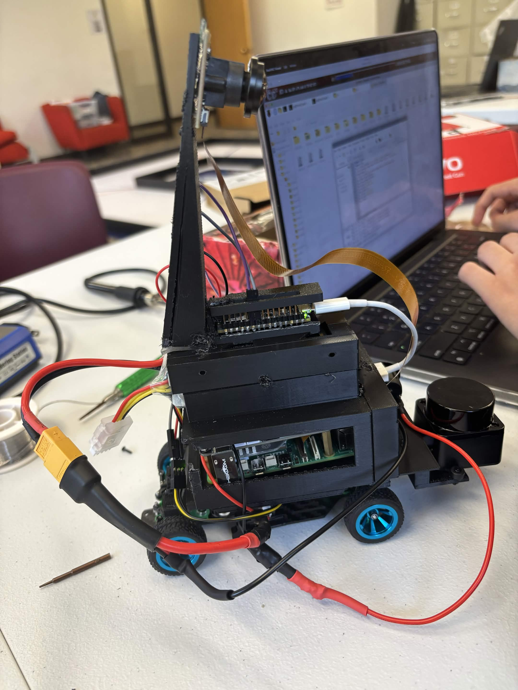
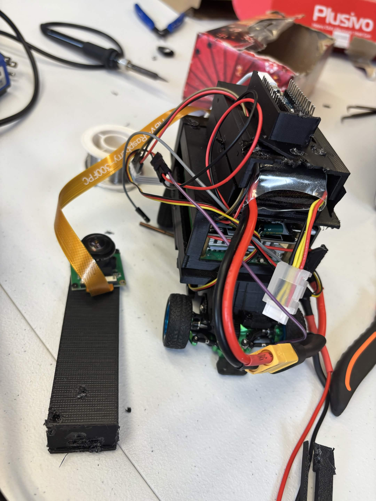

# WRO Future Engineers 2026
Our repository for the 2026 World Robot Olympiad: in the category Future Engineers


# Team Costco Hotdog


## Explorer Robotics


[](https://explorer-robotics.com/index.html)


## Table of Contents
* [The Team](#team-members)
* [Engineering Journal](#engineering-journal)
* [The Challenge](#the-future-engineers-challenge)
* [The Robot](#robot)
  * [Overview](#overview) 
  * [First Design](#first-design)
  * [Design Decisions](#design-decisions)
  * [Final Design](#final-design)
* [Prices](#price-of-the-components)
* [Power](#power)
  * [Power budget](#power-budget)
  * [Regulator & BEC Efficiency Losses](#regulator-and-bec-efficiency-losses)
* [Systems](#systems)
  * [Mechanical System](#mechanical-system)
      * [Motor](#motor)
      * [Servo Motor](#servo-motor)
      * [Wheels](#wheels)
  * [Electrical & Sensor System](#electrical-and-sensor-system)
    * [Regulator](#voltage-regulation)
    * [Circuit Diagram](#circuit-diagram)
* [Software](#software)
* [Testing](#testing)
  * [Test Results](#test-results)
  * [Performance Videos](#video)
    * [Open challenge](#OPCV)
    * [Obstacle Challenge](#OBCV)
* [Future Potential Improvements](#potential-improvements)


# Team Members

### Jonathan Huang
**Age:** 15

**Introduction:**
Hi, my name is Jonathan and I'm from Canada, this is my fifth WRO season. I am interested in airplanes, and enjoy learning about how they work in my free time. Besides that, I enjoy playing video games with my friends. I am currently attending Notre Dame CSS.


### Walter Wu
**Age:** 15

**Introduction:**
Hi, my name is Walter and I'm also from Canada, this is my third WRO season;  I have many interests, such as sports like volleyball, and hobbies ranging from drawing and video games to cooking. I am currently attending All Saints CSS and am enrolled in their Arts & Media Program.

# Our Coach
<table>
  <tr>
    <td width="50%" style="text-align: left;">
       
    </td>
    <td width="50%" style="text-align: left; vertical-align: top;">
      <h3>Accolades:</h3>
      <ul>
        <li>Head coach of Robotics Competitions including FLL (First LEGO League) Tournament and WRO (World Robotics Olympiad). Led teams in winning multiple national, international robotics and programming awards.</li>
        <li>Over 20 years of IT industry experience as software engineer working internationally.</li>
        <li>MSc in Electrical & Computer Engineering from University of Alberta.</li>
        <li>BSc in Mathematics from Peking University.</li>
      </ul>
    </td>
  </tr>
</table>

# Engineering Journal
Here is the link to our [Engineering Journal google document](https://docs.google.com/document/d/1yOxLSaLgVKeupWdl-JZPw-9g1dGKT5EjSAjHi6xOg-0/edit?tab=t.0)

# The Future Engineers Challenge
### Open Challenge

The **Open Challenge** tests our robot's ability to drive autonomously around the track. The robot must complete three laps while adapting to different track layouts, starting positions, and driving directions. The goal is to create a fast and reliable self-driving vehicle that can navigate the track and stop whenever needed without human control.

### Obstacle Challenge

The **Obstacle Challenge** adds red and green traffic signs to the track as well as a parking area. Teams have an option to start and end within the parking area to accumulate more points. While completing three laps, the robot must identify the traffic signs and choose the correct side of the lane to pass on. After finishing the laps, the robot will optionally find the parking area and successfully parallel park.
### Documentation

The **Documentation** focuses on explaining how our robot was designed and developed. Our GitHub repository includes information about the robot's hardware, software, sensors, power system, and driving strategies. It also contains photos, videos, source code, and updates showing our engineering process and improvements throughout the project.

Learn more about the challenges WRO has to offer and the rules accordingly [here](https://wro-association.org/competition/2026-season/) and [here](https://wro-association.org/competition/2026-season/)

# Robot
## Overview

| Dimension | Measurement |
|-----------|-------------|
| Length | 21 cm |
| Width | 10 cm |
| Height | 24.5 cm |
| Wheelbase | 10.2 cm |
| Ground Clearance | 4mm |
| Weight | 567g |

## Drive Configuration

The robot uses a **RWD** drivetrain powered by a **Furitek Micro Komodo 1212 brushless motor** and controlled by a **Furitek Lizard Pro ESC**.

### Drive Components

| Component | Specification |
|-----------|---------------|
| Motor | Furitek Micro Komodo 1212 |
| Motor Type | Brushless DC |
| ESC | Furitek Lizard Pro |
| Drive Type | RWD |
| Driven Wheels | 1/28 RC drift car wheels |

The motor receives speed commands from the control system through the ESC which decodes PWM messages from the Pi. The drivetrain converts the motor's rotation into forward and reverse movement.

### DRIVE TRAIN PHOTO ###


## Steering Configuration

The robot uses **servo-based steering** to control its direction.

### Steering Components

| Component | Specification |
|-----------|---------------|
| Steering Servo | HiTec HS-5055MG Micro Servo |
| Control Signal | PWM |
| Maximum Steering Angle | 45° |
| Steering Type | Ball joint |

The steering servo is connected to the front steering mechanism through a mechanical linkage connecting first to a ball joint to drive the steering system.. The controller adjusts the servo position using PWM signals to change the robot's steering angle.

### STEERING DIAGRAM PHOTO ###

## Main Components

| Component | Purpose |
|-----------|---------|
| Raspberry Pi 5 | Main computer and processing |
| Arduino Nano | Low level commands and processing IMU data |
| Furitek Micro Komodo 1212 | Drives the robot |
| Furitek Lizard Pro ESC | Controls the drive motor |
| Steering Servo | Controls steering |
| D500 LiDAR | Distance measurement |
| Raspberry Pi Camera | Vision and object detection |
| 5 V Regulator | Powers 5 V electronics |
| 11.1 V LiPo Battery | Main power source |
| BMI270 IMU | Used for its gyro sensor |


## Sensors

The robot uses multiple sensors to perceive its surroundings and determine its position on the course.

| Sensor | Purpose | 
|--------|---------|
| Raspberry Pi Camera | Detects and identifies objects/colours |
| D500 LiDAR | Measures distance to surrounding objects/walls |
| IMU | The gyro sensor inside calculates the robot's heading |

Sensor data is processed by the robot's control software and used to make driving and steering decisions.

### PHOTO OF SENSORS ON ROBOT ###

## Computer / Controller

The main computer is a **Raspberry Pi 5**, which processes sensor data and runs the robot's control software.

An **Arduino Nano** is used for low-level control of the robot's steering servo and motor ESC, as well as processing IMU data to track the robot's heading.

### Computer/Controller Components

| Component | Function |
|-----------|----------|
| Raspberry Pi 5 | Main processing, computer vision, navigation and decision-making |
| Arduino Nano | Low level commands and IMU interpretation |
| Motor ESC | Motor control |
| Steering Servo | Steering control |

The Raspberry Pi receives information from the sensors, processes the data, and sends control commands to the Arduino, which then controls the drive and steering systems.

## Battery

The robot is powered by an **11.1 V 2200 mAh 3-cell LiPo battery**.

| Specification | Value |
|---------------|-------|
| Battery Type | LiPo |
| Cells | 3S |
| Nominal Voltage | 11.1 V |
| Capacity | 2200 mAh |
| Average Current | ~3.5 A |
| Peak Current | ~15 A |
| Average Power | ~38 W |
| Estimated Runtime | 40–60 minutes |

The battery directly powers the drive system and provides power to the electronics through the appropriate voltage regulation.


## How It Works

The robot operates using a combination of **computer vision, LiDAR distance sensing, and autonomous control**.

The **Raspberry Pi 5** collects information from the camera and LiDAR and processes this data using the robot's control software. The camera is used to identify relevant objects and course features, while the LiDAR provides distance measurements to help the robot understand its surroundings.

Based on the sensor data, the software determines the appropriate **steering angle and driving speed**. Steering commands are sent to the steering servo, while drive commands are sent to the motor through the **Furitek Lizard Pro ESC**.

The robot continuously repeats this process:

**Sense → Process → Decide → Drive/Steer → Sense**


## First design
These are a couple pictures of the first variation of our robot
| *Side* | *Camera Detached* |
| :--: | :--: | 
|  |  | 

### Early CAD designs
The following are photos of early iterations for the chassis and camera stand
| *Camera Stand* | *Chassis* |
| :--: | :--: | 
|  |  | 

## Design Decisions
A lot of the design decisions were based on the information and research done on previous robots from both team members and our club.
| Challenge | Decision | Reasoning |
|---|---|---|
| Drive system | Furitek Micro Komodo 1212 BLDC motor with a Furitek Lizard Pro ESC | Provides enough torque and speed for the robot while remaining compact and efficient. The brushless motor also provides reliable and precise control. |
| Size | 1/24 - 1/28 scale | A compact design makes the robot easier to maneuver, turn, and navigate through tight sections of the course while staying within the competition size limits. |
| Battery | 11.1 V 2200 mAh 3-cell LiPo battery | Provides enough voltage for the drive system and sufficient capacity for the robot to operate throughout a run while keeping the overall weight low. |
| Controller | Raspberry Pi 5 with an Arduino Nano | The Raspberry Pi 5 handles sensor processing, decision-making, and higher-level control, while the Arduino Nano handles real-time communication with the drive and steering systems. |
| Sensors | D500 LiDAR, Raspberry Pi Camera, and BMI270/BMM150 IMU | LiDAR provides distance measurements for navigation and wall detection, the camera provides visual information, and the IMU provides orientation and motion data for more accurate movement and turning. |

A **more detailed breakdown** of our decisions can be found in our [Engineering Journal](https://docs.google.com/document/d/1yOxLSaLgVKeupWdl-JZPw-9g1dGKT5EjSAjHi6xOg-0/edit?tab=t.0#heading=h.9aapqalinc39)

## Final Design
Here is a GIF and photos of our final design
| *360° View* |
| :--:|
| *####MISSING####* |

| *Front* | *Back* |
| :--: | :--: |
|  |  | 
| *Left* | *Right* |
|  |  | 
| *Top* | *Bottom* |
|  |  | 

Click [here](Electrical/README.md#why-we-changed-the-robot) to see the main differences between the first and final renditions of our robot

# Price of the Components
| Component  | Cost |
| ------------- | ------------- |
| [BLDC Motor](https://furitek.com/products/furitek-micro-komodo-1212-3456kv-brushless-motor-with-15t-steel-pinion-for-fury-wagon-fx118)  | $34.99 | 
| [Furitek Lizard Pro ESC](https://furitek.com/products/combo-of-furitek-lizard-pro-30a-50a-brushed-brushless-esc-for-axial-scx24-with-bluetooth) | $79.99 | [here](https://furitek.com/products/combo-of-furitek-lizard-pro-30a-50a-brushed-brushless-esc-for-axial-scx24-with-bluetooth) |
| [Servo Motor](https://hitecrcd.com/hs-5055mg-economy-metal-gear-feather-servo/)  | $29.99  |
| [Camera](https://www.amazon.ca/dp/B0D324RKRZ?ref=ppx_yo2ov_dt_b_fed_asin_title)  | $43.30 |
| [Raspberry Pi 5 + MicroSD card + Additions](https://www.pishop.ca/product/raspberry-pi-5-8gb/?src=raspberrypi)  | $312.80  |
| [Arduino Nano](https://store-usa.arduino.cc/products/nano-33-ble-sense-rev2-with-headers)   | $39.70  |
| [Chassis](https://www.aliexpress.com/item/1005010095696996.html?spm=a2g0o.productlist.main.5.723cofcWofcWlh&algo_pvid=2a715fdb-fb6d-4899-8280-a215c2b2d032&algo_exp_id=2a715fdb-fb6d-4899-8280-a215c2b2d032-4&pdp_ext_f=%7B%22order%22%3A%2275%22%2C%22eval%22%3A%221%22%2C%22fromPage%22%3A%22search%22%7D&pdp_npi=6%40dis%21CAD%21576.58%21138.38%21%21%212894.48%21694.68%21%40210328c017699769899361575e43e8%2112000051128234698%21sea%21CA%210%21ABX%211%210%21n_tag%3A-29910%3Bd%3A144f3923%3Bm03_new_user%3A-29895&curPageLogUid=zbORjXdo3UaO&utparam-url=scene%3Asearch%7Cquery_from%3A%7Cx_object_id%3A1005010095696996%7C_p_origin_prod%3A#nav-review)  | $140.38  |
| [3-cell Battery](https://www.amazon.ca/Zeee-Battery-Connector-Airplane-Helicopter/dp/B0D5LKXHBK/ref=sr_1_5?crid=2JRB855SKW7EL&dib=eyJ2IjoiMSJ9.zuMSsrpJTPMqUC9ImIBkmV4v4x4hdFTFq9BqWiEWE0jqOxI6oDn5l1-ZgCRG0X88Kbh_ngpDrcc41PEd67Tv4SMC3-YfOILewxoaVUX26pIiGS3GsPwA1lSosDHRkJqGSuboG13pQzZT8-YMQDT6nLyrvlKogiwD2-4ZJqq-w9Zfc-BIydlygDGrIcn9Iq8gRbixYnQTLDIbxYkFMJwV-vm6SSuI4JJFe2qe2MX1r9d4_WRuxW5mZKGwtqqm8_BORUz9hJPijcxB6StPEOHx4_ty6BIzwp5swaUASUKlbtE.9GlojnF5dxjozmO9taqUzfztTD3UhDYnDdFgq4NITd0&dib_tag=se&keywords=11.1+v+cell+battery&qid=1769377081&sprefix=11+1+v+cell+battery%2Caps%2C133&sr=8-5)  | $46.99  |
| [LiDAR sensor](https://www.aliexpress.com/item/1005003012681021.html?spm=a2g0o.order_list.order_list_main.31.67dd18029q37Y0)  | $81.14  |
| [Regulator](https://ca.robotshop.com/products/yahboom-power-supply-expansion-board-raspberry-pi-5) | $17.54 |
| [Nano tape](https://www.amazon.ca/Ohayooz-Removable-Adhesive-Washable-Waterproof/dp/B0DJX3J7V6/ref=sr_1_5?dib=eyJ2IjoiMSJ9.4xs5nq5gFcHaOOpzaJjaMN0_azbULmeVyD8pNeklZcDBx1WeliPTh1GmLrq_QszISStyy2xWNMsVTvi9F2-MjdOFE1uMqWsDOs4wMZy9eCiTZcGXj-_p1O76AdoWVeJdbd9oE0J45jQPuQHyVvC5U_d3zSNre8Yo6vamYCPCTLxT3ojPra2FbWc6d77g_bmG1Mkmak3yqo0TmhIXMXnrilEh7iyucooazrCGLo7r01bNEm9QjQfJgwg0kl0sJAzUFfbutXz_a7xbWKLfesgSTevqlMMsHLOt2WqoNA0ZjUI.SWvS86ikc4qES7ofzt8WUfOumJGDljk0pQOSa4xiubs&dib_tag=se&keywords=nano%2Btape&qid=1782078372&sr=8-5&th=1) | $9.97 |
| [3d-prints](3d-prints) | $*** |
| [Screw Set](https://www.aliexpress.com/item/1005002438190831.html) | $22.65 |
| [Wheels](https://www.amazon.ca/AllinRC-Pre-glued-Compatible-WLtoys-Racing/dp/B0B4DH61L9/ref=sr_1_14?crid=QZ0121YI3198&dib=eyJ2IjoiMSJ9.QJZd0ar8ehCcAtHZG2Cyl6PoyAFGZwEOcYA82wZyA45A7hnFD-N6i5WUQNJQQ5ZMctX5NR70HJd1PKE11N4uLqc-NyOsA5w7RR7l-HHHaxQfAv3DUfy4bmMrjt60gOF4PKK5zL7GlH1rZq3ozSlZntAaRzzGgRm_m6qeqB5FTlBql4sWxGOhj7D9dbpxUNwIsXUO_j2BYpu7WjhJrKYbBN4nvb0HSS0SILDtaQJuE7YjVr__sEwPc0HOAaoLpi1fSRvueEwpht6ciW26XOKRiKRQFm5EJz8l5SwWa7qmFu4.jT9UwEPv9LPwFMaTVk2SNUaIlbf-uy0nCjSzeU-9MaQ&dib_tag=se&keywords=rc%2Bcar%2Bwheels%2B1%2F28&qid=1769998887&sprefix=rc%2Bcar%2Bwheels%2B1%2F28%2Caps%2C143&sr=8-14&th=1) | $26.87 |
| Total Price Before Tax   | $***  |
| Total Price   | $***  |

***The additions to the RASPI 5 include but are not limited to USB-C PD Power Supply, Raspberry Pi Active Cooler, and a Micro-HDMI to HDMI cable***

# Power

## Power Budget

| Component | Voltage (V) | Current (A) | Power (W) | Notes / Rail |
| :--- | :--- | :--- | :--- | :--- |
| Raspberry Pi 5 | 5.0 | 1.80 | 9.00 | 5V Regulated Rail |
| Pi Camera | 5.0 | 0.25 | 1.25 | 5V Regulated Rail |
| Arduino Nano | 5.0 | 0.03 | 0.15 | 5V Regulated Rail |
| D500 LiDAR | 5.0 | 0.20 | 1.00 | 5V Regulated Rail |
| HiTec HS-5055MG Servo | 6.0 | 0.15 | 0.90 | 6V BEC Rail |
| Furitek ESC Electronics | 6.0 | 0.05 | 0.30 | 6V BEC Rail |
| Furitek Micro Komodo 1212 Motor | 11.1 | 2.00 | 22.20 | 11.1V Direct Rail |
| **Total Device Power** | | | **34.80 W** | |

---

## Battery Specifications

| Parameter | Value |
| :--- | :--- |
| **Brand / Model** | Zeee 3S LiPo |
| **Battery Type** | LiPo |
| **Cell Count** | 3S |
| **Nominal Voltage** | 11.1 V |
| **Capacity** | 2200 mAh (2.2 Ah) |
| **Energy** | 24.42 Wh ($11.1\text{ V} \times 2.2\text{ Ah}$) |
| **Discharge Rating** | 50C |
| **Maximum Continuous Current** | 110 A ($2.2\text{ Ah} \times 50\text{C}$) |

---

## Regulator and BEC Efficiency Losses

* **5V Regulated Rail (Yahboom Power Board @ 92% Efficiency):**

The Yahboom Raspberry Pi 5 power board operates at approximately **92% efficiency**. Supplying the 11.4 W 5V rail requires approximately 12.39 W from the battery, resulting in about 0.99 W of conversion losses.
  * 5V rail power demand: `11.40 W`
  * Battery-side power required: $\frac{11.40\text{ W}}{0.92} = 12.39\text{ W}$
  * 5V conversion losses: `0.99 W`

* **6V BEC Rail (Furitek Lizard Pro Internal BEC @ 85% Efficiency):**

A BEC (Battery Eliminator Circuit) loses efficiency primarily because converting a higher voltage (like 11.1V from a 3S LiPo) down to a lower voltage (like 6.0V for a servo) generates heat and requires power to run its own circuit.
  * 6V rail power demand: `1.20 W` ($0.90\text{ W} + 0.30\text{ W}$)
  * Battery-side power required: $\frac{1.20\text{ W}}{0.85} = 1.41\text{ W}$
  * 6V conversion losses: `0.21 W`

---


## Total Battery Power Consumption

| Quantity | Value |
| :--- | :--- |
| **Total Device Power** | 34.80 W |
| **5V Regulator Losses** | 0.99 W |
| **6V BEC Conversion Losses** | 0.21 W |
| **Total Battery Power Draw** | **36.00 W** |

---

## Runtime Calculation

$$\text{Runtime} = \frac{\text{Battery Energy}}{\text{Total Power}} = \frac{24.42\text{ Wh}}{36.00\text{ W}} \approx 0.678\text{ hours}$$

$$0.678\text{ h} \times 60 \approx 40.7\text{ minutes}$$

---

## Estimated Runtime

| Operating Condition | Runtime |
| :--- | :--- |
| Full-speed continuous driving | ~40 min |
| A normal WRO run (mixed acceleration) | ~50–60 min |
| Idle robot with vision processing | ~90 min |

---

## Battery Current Draw & Capability Check

### Average Battery Current
$$I_{\text{avg}} = \frac{P_{\text{total}}}{V_{\text{nominal}}} = \frac{36.00\text{ W}}{11.1\text{ V}} \approx 3.24\text{ A}$$

### Peak & Discharge Safety Margin
* **Zeee 3S Battery Continuous Max:** `110 A` ($2.2\text{ Ah} \times 50\text{C}$)
* **Estimated Peak Demand:** `12–16 A` (Motor stall + high servo load)
* **Safety Margin Factor:** $\frac{110\text{ A}}{16\text{ A}} \approx 6.87\times$

The Zeee LiPo battery can comfortably supply peak loads well within thermal safety limits.

---

## Power Rail Distribution

### 11.1V Direct Battery Rail
* **Connected Components:** Furitek Lizard Pro ESC & Furitek Micro Komodo 1212 Motor
* **Average Current:** `2.00 A`
* **Peak Current:** `8.00–12.00 A`
* **Average Power:** `22.20 W`

### 6V BEC Rail (Integrated ESC BEC @ 85% Efficiency)
* **Connected Components:** HiTec HS-5055MG Servo & ESC Electronics
* **Average Current:** $0.15\text{ A} + 0.05\text{ A} = 0.20\text{ A}$
* **Peak Current:** $0.70\text{ A} + 0.10\text{ A} \approx 0.80\text{ A}$
* **Average Power:** $6.0\text{ V} \times 0.20\text{ A} = 1.20\text{ W}$

### 5V Regulated Rail (Yahboom Power Board @ 92% Efficiency)
* **Connected Components:** Raspberry Pi 5, Camera, D500 LiDAR, Arduino Nano
* **Average Current:** $1.80\text{ A} + 0.25\text{ A} + 0.20\text{ A} + 0.03\text{ A} = 2.28\text{ A}$
* **Power Delivered to Electronics:** $5.0\text{ V} \times 2.28\text{ A} = 11.40\text{ W}$
* **Battery Power Consumed (with efficiency loss):** $\frac{11.40\text{ W}}{0.92} = 12.39\text{ W}$
* **Battery Current Consumed:** $\frac{12.39\text{ W}}{11.1\text{ V}} \approx 1.12\text{ A}$
* **Recommended Regulator Rating:** Minimum `5V @ 4A` continuous output.


## Overview
The robot’s power source is an 11.1V, 2200mAh, 3-cell LiPo battery. The drive unit includes a Furitek Micro Komodo BLDC motor and Furitek Lizard Pro controller. A 5V power supply is used for powering the Raspberry Pi 5, LiDAR sensor, camera, and Arduino Nano. The average total battery power consumption of the robot is 36.0 W, which includes the Raspberry Pi 5 (9.0 W), camera (1.25 W), LiDAR sensor (1.0 W), steering servo (0.9 W), Arduino Nano (0.15 W), Furitek electronics and brushless drive system (22.5 W), and conversion losses (1.20 W). The average current consumption from the battery is approximately 3.24 A, which provides an estimated continuous full-speed runtime of about 40 minutes (and 50–60 minutes under typical WRO run conditions). The estimated maximum peak current demand during acceleration or stall is 12–16 A.


# Systems
## Mechanical System

The mechanical system forms the basis for the framework, motion, and steering of the robot. This is made up of the chassis, drive motor, servo motor, wheels, and steering. Each part has been chosen and placed precisely to ensure stability, maneuverability, durability, and space.

### Chassis

The chassis acts as the main structure of the robot and houses the mounting points for the drive systems, steering systems, battery, electronics, and sensors. The chassis design is done in such a way that the robot remains small yet has room for all the parts while remaining lightweight. The mounting of the components ensures that they remain stable.

**Chassis Specifications:**

| Specification | Value |
|---|---|
| Material | Plastic & Carbon-Fiber |
| Length | 21cm |
| Width | 10cm |
| Height | 22.5cm |

### Motor

The robot incorporates a **Furitek Micro Komodo 1212 brushless DC motor** for its drive system. The motor is controlled through the use of a **Furitek Lizard Pro ESC**, which controls the amount of energy being supplied to the motor. The motor supplies the energy needed to rotate the wheels and was chosen due to its speed and torque.

**Motor Specifications:**

| Specification | Value |
|---|---|
| Motor | Furitek Micro Komodo 1212 |
| Type | Brushless DC (BLDC) |
| Operating Voltage | 11.1 V |
| Average Current | 2.0 A |
| Average Power | 22.2 W |
| ESC | Furitek Lizard Pro |

### Servo Motor

The steering of the robot is controlled by the servo motor. The servo motor will receive the signals from the Arduino for the steering and turn to the appropriate position. This movement is transmitted through the steering linkage to adjust the front wheels' angles. The servo was chosen because it provided the necessary torque and fit in the restricted space of the robot.

**Servo Specifications:**

| Specification | Value |
|---|---|
| Servo Model | [HiTec HS-5055MG Micro Servo] |
| Operating Voltage | [4.8-6.0V] |
| Torque | [18.05-22.2 oz-in] |
| Steering Range | [~80°] |
| Average Power | 3.0 W |

### Wheels

Wheels are used in the design to give traction and stability during movement. The wheels are mechanically linked with the drivetrain system in order to transmit power from the drive motor to the wheels. The size and tread pattern of the wheels have been chosen keeping in mind the traction and stability requirements.

**Wheel Specifications:**

| Specification | Value |
|---|---|
| Number of Wheels | 4 |
| Wheel Diameter | ~30mm |
| Wheel Width | 12mm |
| Material | Aluminum Alloy |
| Tread Type | Slick/Smooth Tread |

### Steering

We use a RWD system for the robot which is powered by the servo motor. The servo causes the steering linkage to change the angle at which the front wheels point, and hence steer the robot. The steering system has been engineered to have accurate steering control and minimal movement or sloppiness of the linkage.

**Steering Configuration:**

| Specification | Value |
|---|---|
| Steering Type | Power-assisted |
| Steering Wheels | Front wheels |
| Steering Actuator | Servo motor |
| Steering Mechanism | Ball joint |
| Maximum Steering Angle | 45° |

## Electrical and Sensor Systems

The electrical and sensor systems are responsible for providing power, sensing, and communication between different parts of the robot. The system includes a 11.1 V lithium polymer battery, the Raspberry Pi 5, the Arduino Nano, a Raspi camera, the LiDAR, and the electronics related to driving and steering of the robot. All these parts interact with each other to sense the environment for the robot.

*You can refer back to our [Power section](#power) for the detailed specifications on the battery and power budget.*

### Voltage Regulation

The battery provides a nominal voltage of **11.1 V**, while several components require lower operating voltages. Voltage regulators are therefore used to provide stable power to the electronics.

A regulated **5 V supply** powers the Raspberry Pi 5, Pi Camera, Arduino Nano, and D500 LiDAR. The steering servo and ESC electronics operate from an appropriate regulated supply. Voltage regulation protects the electronics from unsuitable voltage levels and helps maintain stable operation throughout the robot's run.

**Voltage Distribution:**

| Component | Required Voltage | Power Source |
|---|---:|---|
| Raspberry Pi 5 | 5.0 V | Voltage Regulator |
| Pi Camera | 5.0 V | 5 V Supply |
| Arduino Nano | 5.0 V | 5 V Supply |
| D500 LiDAR | 5.0 V | 5 V Supply |
| Servo Motor | 6.0 V | Regulated Supply |
| ESC | 6.0 V | Regulated Supply |
| Drive Motor | 11.1 V | Battery |

### Circuit Diagram 

The electrical system connects the battery, voltage regulators, Raspberry Pi, Arduino, sensors, ESC, servo, and drive motor.

The **Raspberry Pi 5** processes information from the camera and LiDAR and communicates control commands to the Arduino. The Arduino controls the steering servo and communicates with the drive system. The battery provides the main power source, while voltage regulation provides the appropriate voltages for the individual components.


**Electrical System Flow:**

```text
                    11.1 V LiPo Battery
                            |
             +--------------+--------------+
             |                             |
             v                             v
       Voltage Regulators             Lizard Pro ESC
             |                             |
      +------+------+                      v
      |      |      |                Micro Komodo
      |      |      |                    Motor
      v      v      v
 Raspberry Arduino  D500
   Pi 5     Nano   LiDAR
     |
     v
 Pi Camera

Arduino Nano
     |
     +----> Steering Servo
```
## Camera

The robot uses a **Raspberry Pi Camera** which excels in taking images of the surrounding environment during the competition. Images provided by the camera are analyzed by the Raspberry Pi 5, helping the robot recognize various aspects of the course.

The camera is mounted on the Raspberry Pi so that it gives a good picture of the space in front of the robot including the side walls. The images taken by the camera are processed using computer vision algorithms before being used for navigation.

### Camera Specifications

| Specification | Value |
|---|---|
| Camera | Raspberry Pi Camera |
| Interface | 15-pin MIPI CSI |
| Resolution | 1080p @ 30fps / 720p @ 60fps |
| Field of View | 175° |
| Purpose | Computer Vision / Navigation |

## LiDAR

The robot uses a **D500 LiDAR sensor** for parking only. The LiDAR provides distance measurements that allow the Raspberry Pi to determine the robot's position relative to the parking walls and outside walls.

LiDAR data is processed by the Raspberry Pi and used by the navigation system to maintain the desired distance from walls and detect changes in the robot's surroundings.

### LiDAR Specifications

| Specification | Value |
|---|---|
| Sensor | D500 LiDAR |
| Connection | 4-pin JST |
| Operating Voltage | 5.0 V |
| Average Current | 0.20 A |
| Average Power | 1.00 W |
| Primary Purpose | Distance Measurement |

## Sensor Placement

The placement of the camera and LiDAR was designed while keeping in mind not to block anything from the front and sides of their FOV.

The **camera** is positioned to provide a clear lifted forward-facing view of the course. The **LiDAR** is positioned so that it can measure the distance between the robot and surrounding walls or obstacles. The sensors are mounted securely to prevent movement and maintain consistent measurements during operation.

### PICTURE OF SENSORS ON ROBOT ###


# Software

# Autonomous Robot State Machine Documentation

## 1. ASCII State Machine Diagram

```text
                        +---------------------------------------+
                        |            INITIALIZATION             |
                        | - Init Serial & Cam                   |
                        | - Servo = 66                          |
                        | - Motor = 1500 -> 1622                |
                        +-------------------+-------------------+
                                            |
                                            v
                        +---------------------------------------+
   +------------------->|              WALL_FOLLOW              |<-------------------+
   |                    | - Steering: PD Control                |                    |
   |                    |   (leftArea-rightArea)                |                    |
   |                    | - Speed = 1622                        |                    |
   |                    +----+-----------------------------+----+                    |
   |                         |                             |                         |
   |                         |                             |                         |
[No Pillar for               |                             | [low_left/right         | [Gyro turned
 8 consecutive               | [Active Color]              |  for 5 frames           |  <= GYRO_VAL]
 frames]                     |                             |  AND time_elapsed]      |  OR [Area grew
   |                         v                             v                         |  AND time_ok]
   |            +-------------------------+   +-------------------------+            |
   +------------|      PILLAR_AVOID       |   |       CORNER_TURN       |------------+
                | - Target CX:            |   | - Servo: 41° L / 81° R  |
                |   Red(40)/Grn(600)      |   | - Speed = 1622          |
                | - Steering: P Control   |   | - turn_count ++         |
                +-------------------------+   | - lap_count ++          |
                                              |   (every 4 turns)       |
                                              +------------+------------+
                                                           |
                                                   [turn_count >= 12]
                                                           |
                                                           v
                        +---------------------------------------+
                        |                END_RUN                |
                        | - end_run_counter ++                  |
                        +-------------------+-------------------+
                                            |
                                  [counter >= 100 frames]
                                            |
                                            v
                        +---------------------------------------+
                        |                 STOP                  |
                        | - Servo = 66 (Center)                 |
                        | - Motor = 1500 (Stop)                 |
                        | - Cleanup & Exit                      |
                        +---------------------------------------+
```

---

## 2. State Descriptions

### INITIALIZATION
* **Function**: Sets up hardware interfaces (Serial connection with Arduino running at 115200 baud rate, setting up PiCamera2)
* **Operations**:
  * Default position set for the servos (66) and for the motor (1500).
  * Serial buffer reset and Motor Drive operation set to start driving (1622).
* **Next State**: Transition to WALL_FOLLOW occurs immediately.

### WALL_FOLLOW
* **Function**: Operating state by default. It moves straight ahead in the lanes using wall following.
* **Controller**: PD Controller based on the difference in area between the left (ROI1) and right (ROI2) black walls' contours.
  $$\text{error} = \frac{\text{leftArea} - \text{rightArea}}{\text{leftArea} + \text{rightArea}}$$
* **Transitions**:
  * **To PILLAR_AVOID**: Occurs when active_color is observed (`red_area` or `green_area` > MIN_REACT_AREA [800]).
  * **To CORNER_TURN**: Occurs when low_left or low_right (< 1000) is observed for ENTER_CONFIRM_FRAMES (5) successive frames and time_elapsed is true.
  * **To END_RUN**: Occurs when turn_count >= TURN_LIMIT (12).

### PILLAR_AVOID
* **Purpose**: Dodges obstacle pillars through detection with HSV color thresholding.
* **Control Logic**:
  * Target RED_TARGET_CX (40) for red pillars or GREEN_TARGET_CX (600) for green pillars.
  * Utilizes Proportional control using dynamic cx error correction formula:
    $$\text{correction} = kp_{\text{avoid}} + (active_{\text{cx}} - target_{\text{cx}})$$
* **Transitions**:
  * **To WALL_FOLLOW**: Triggers when frames_without_pillar >= PILLAR_EXIT_FRAMES (8 frames).

### CORNER_TURN
* **Purpose**: Implements predetermined 90° turns.
* **Control Logic**:
  * Runs with motor at CORNER_TURN_MOTOR_VALUE (1622).
  * Turns servo at TURN_LEFT_ANGLE (41°) or TURN_RIGHT_ANGLE (81°) as dictated by turn_trigger_side.
  * Increases turn_count by 1, increment lap_count every 4 turns.
* **Transitions**:
  * **To WALL_FOLLOW**:
    * **If Gyro Mode is active (TOGGLE_GYRO_TURN)**: Triggers when abs_turn_heading <= GYRO_TURN_VAL (15°).
    * **If Vision Mode is active**: Triggers when wall contour area increases past threshold (grew_ok) AND EXIT_TIME_SEC elapsed OR MAX_TIME_SEC (10.0s) elapsed.

### END_RUN & STOP
* **Purpose**: Shutdown protocol after run completion.
* **Actions**:
  * Counts up to END_RUN_LIMIT (100 frames).
  * Neutralizes steer at 66 and motor at 1500.
  * Releases camera feed and serial port.
  
---

## 3. Threshold & Control Constants

| Constant | Value | Unit / Description |
| :--- | :--- | :--- |
| `WALL_FOLLOW_MOTOR_VALUE` | `1622` | Forward driving speed pulse width |
| `LEFT_ENTER_TURN_THRESH` | `1000` | Area drop threshold for corner entry |
| `ENTER_CONFIRM_FRAMES` | `5` | Debounce frame count before turning |
| `PILLAR_EXIT_FRAMES` | `8` | Consecutive clear frames required to exit avoid mode |
| `MIN_REACT_AREA` | `800` | Minimum pillar contour area to trigger avoidance |
| `TURN_LIMIT` | `12` | Total corners completed before terminating run |
| `Kp` / `Kd` | `15` / `-1` | PD parameters for wall following |
